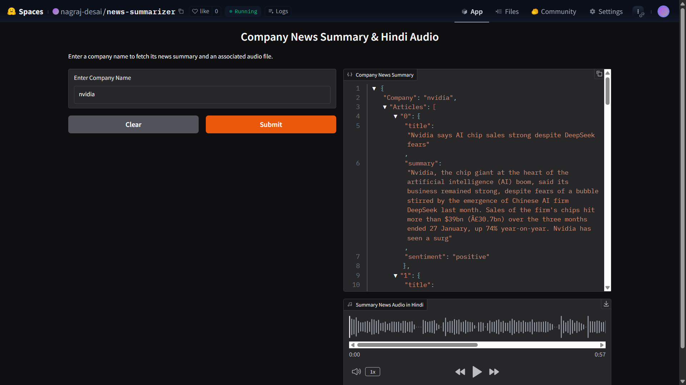

# News Summarizer with TTS

## 📌 Project Overview

This project takes a **company name** as input, fetches the latest **news articles** using BeautifulSoup, generates a **comprehensive summary** by analyzing all the articles, translates the summary into **Hindi**, and finally converts it into a **Hindi speech file** using Text-to-Speech (TTS) technology.

## 🚀 Try It on Hugging Face Spaces

🔗 **[Live Demo](https://huggingface.co/spaces/nagraj-desai/news-summarizer)**  
_Click the link to test the app live on Hugging Face Spaces._

🚀 **Note:** This app may take some time to run. Please be patient while it processes the request.

## 🛠️ Project Setup

1. **Create a Python environment:**

```bash
conda create -n venv python=3.11 -y
```

2. **Activate the environment:**

```bash
conda activate venv
```

3. **Install the required dependencies:**

```bash
pip install -r requirements.txt
```

4. **Create .env file:**

Create a `.env` file to store the API keys.

```bash
HF_TOKEN=<hugging-face-api-key>
```

## 🖥️ Demo Output

  
_Example output showing summarized news and audio file generation._

## 📁 Project Structure

```
news-summarizer-tts/
│── src/
│   ├── __init__.py
│   ├── news_scraper.py
│   ├── summarizer.py
│   ├── sentiment.py
│   ├── tts_generator.py
│
│── research/
│   ├── trials.ipynb
│
│── news_articles/
│
│── audio_files/
│
│── .env
│── requirements.txt
│── setup.py
│── app.py
│── README.md
│── Dockerfile
```
